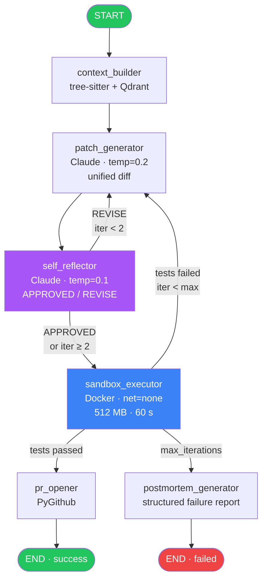
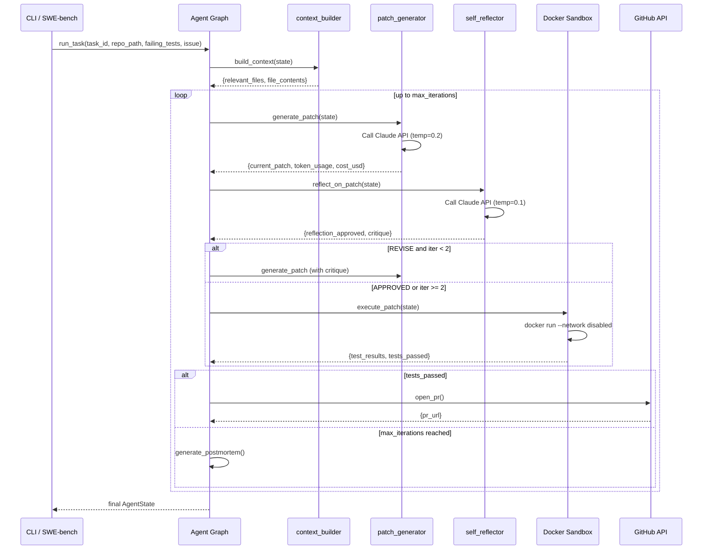
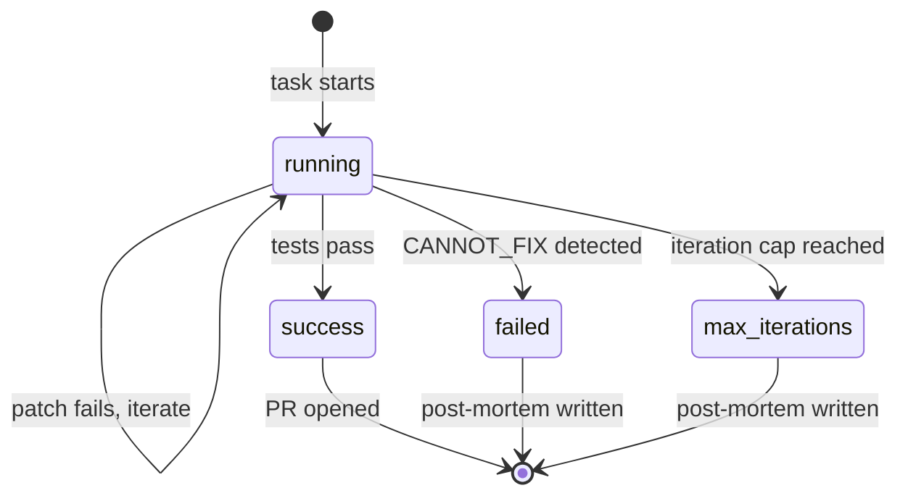

<div align="center">

# 🔧 Self-Healing Agent

### Autonomous Code Repair Powered by LangGraph + Claude

[](https://github.com/inamdarmihir/self-healing-agent/actions/workflows/ci.yml)
[](https://www.python.org/downloads/)
[](LICENSE)
[](https://github.com/langchain-ai/langgraph)
[](https://www.anthropic.com/)
[](https://www.docker.com/)
[](https://github.com/inamdarmihir/self-healing-agent/actions)
[](https://github.com/astral-sh/ruff)
[](https://mypy-lang.org/)

**An autonomous LangGraph agent that diagnoses failing tests, generates patches, executes them in an isolated Docker sandbox, and iterates — with a self-reflection loop and structured post-mortem on failure.**

[Quick Start](#-quick-start) · [Architecture](#-architecture) · [Configuration](#-configuration) · [Docker](#-docker) · [Contributing](CONTRIBUTING.md)

</div>

---

## 📋 Table of Contents

- [Overview](#-overview)
- [Why This Exists](#-why-this-exists)
- [Key Features](#-key-features)
- [Architecture](#-architecture)
- [Tech Stack](#-tech-stack)
- [Compatibility Matrix](#-compatibility-matrix)
- [Installation](#-installation)
- [Quick Start](#-quick-start)
- [Project Structure](#-project-structure)
- [Configuration](#-configuration)
- [Environment Variables](#-environment-variables)
- [Usage](#-usage)
- [CLI Reference](#-cli-reference)
- [Docker](#-docker)
- [Testing](#-testing)
- [CI/CD](#-cicd)
- [Benchmark & Performance](#-benchmark--performance)
- [Security](#-security)
- [Logging & Monitoring](#-logging--monitoring)
- [FAQ](#-faq)
- [Troubleshooting](#-troubleshooting)
- [Roadmap](#-roadmap)
- [Changelog](#-changelog)
- [Contributing](#-contributing)
- [License](#-license)
- [Acknowledgements](#-acknowledgements)
- [Maintainers & Community](#-maintainers--community)

---

## 🔍 Overview

`self-healing-agent` is a production-quality autonomous code repair system. Given a repository, a set of failing tests, and an optional issue description, it:

1. **Builds context** — uses tree-sitter import-graph analysis and Qdrant semantic search to identify the files most relevant to the failure.
2. **Generates a patch** — calls Claude at `temperature=0.2` to produce a minimal unified diff.
3. **Reflects** — a second LLM call critiques the patch for regression risk and root-cause validity before it ever touches the sandbox.
4. **Executes** — applies the patch inside a hardened Docker container (no network, 512 MB RAM, 60 s timeout) and runs `pytest`.
5. **Iterates** — if tests still fail, feeds the sandbox output back to the patch generator up to `max_iterations` times.
6. **Reports** — on success it opens a GitHub PR; on failure it writes a structured post-mortem with root-cause hypothesis and human-readable next steps.

---

## 💡 Why This Exists

Most LLM-based code repair demos apply a single patch and call it done. Real bug-fixing is an iterative, feedback-driven loop — much closer to how a human engineer actually works. `self-healing-agent` encodes that loop explicitly:

- **Pre-sandbox reflection** catches obvious mistakes before burning compute.
- **Sandbox feedback** provides ground-truth signal that is more valuable than another LLM opinion on later iterations.
- **Honest post-mortems** mean every failed task leaves behind actionable information — no silent failures, no inflated success rates.
- **Full cost accounting** makes economics transparent: every token, every LLM call, every dollar tracked.

---

## ✨ Key Features

| Feature | Description |
|---|---|
| 🔁 **Self-reflection loop** | Second LLM call critiques the patch before sandbox execution — runs on iterations 0 and 1 only (cost-controlled) |
| 🐳 **Hardened Docker sandbox** | `network_disabled=True`, 512 MB RAM, 1 CPU, 60 s timeout; repo mounted read-only |
| 🌳 **tree-sitter context** | Import-graph traversal identifies truly relevant files rather than naive filename matching |
| 🔎 **Semantic search** | Qdrant + fastembed finds semantically related files missed by the import graph |
| 📝 **Structured post-mortems** | Every failed task gets a root-cause hypothesis and concrete human next-steps |
| 💰 **Full observability** | Token count, LLM calls, iteration count, and USD cost tracked per task |
| 📊 **SWE-bench harness** | Built-in evaluation against SWE-bench Lite with the unbiased pass@k estimator |
| 🔀 **GitHub PR integration** | Successful patches automatically open a pull request via PyGithub |
| 🧪 **Fully mocked tests** | `>80%` coverage; no real API key or Docker daemon required to run the suite |
| 🔧 **Pluggable nodes** | Add a new LangGraph node in three steps; see [CONTRIBUTING.md](CONTRIBUTING.md) |

---

## 🏗 Architecture

### Agent Graph



### Sequence Diagram



### State Machine



---

## 🛠 Tech Stack

| Component | Technology | Version |
|---|---|---|
| Agent framework | [LangGraph](https://github.com/langchain-ai/langgraph) | `>=0.2.0` |
| LLM client | [Anthropic SDK](https://github.com/anthropic-ai/anthropic-sdk-python) | `>=0.28.0` |
| LangChain adapter | [langchain-anthropic](https://github.com/langchain-ai/langchain) | `>=0.1.0` |
| Container runtime | [Docker SDK for Python](https://docker-py.readthedocs.io/) | `>=7.0.0` |
| Code parsing | [tree-sitter](https://tree-sitter.github.io/tree-sitter/) + [tree-sitter-python](https://github.com/tree-sitter/tree-sitter-python) | `>=0.21.0` |
| Token counting | [tiktoken](https://github.com/openai/tiktoken) | `>=0.7.0` |
| Vector store | [Qdrant](https://qdrant.tech/) + fastembed | `>=1.9.0` |
| GitHub integration | [PyGithub](https://pygithub.readthedocs.io/) | `>=2.0.0` |
| CLI | [Typer](https://typer.tiangolo.com/) | `>=0.12.0` |
| Terminal output | [Rich](https://rich.readthedocs.io/) | `>=13.0.0` |
| Linter | [Ruff](https://docs.astral.sh/ruff/) | `>=0.4.0` |
| Type checker | [mypy](https://mypy.readthedocs.io/) `--strict` | `>=1.10.0` |
| Test runner | [pytest](https://docs.pytest.org/) + pytest-cov + pytest-asyncio | `>=8.0.0` |
| Runtime | Python | `>=3.11` |

---

## 🔄 Compatibility Matrix

| Python | LangGraph | Anthropic SDK | Docker SDK | Status |
|---|---|---|---|---|
| 3.13 | >=0.2.0 | >=0.28.0 | >=7.0.0 | ✅ Supported |
| 3.12 | >=0.2.0 | >=0.28.0 | >=7.0.0 | ✅ Supported |
| 3.11 | >=0.2.0 | >=0.28.0 | >=7.0.0 | ✅ Supported (CI) |
| 3.10 | — | — | — | ❌ Not supported |
| <3.10 | — | — | — | ❌ Not supported |

| Model | Supported | Notes |
|---|---|---|
| `claude-sonnet-4-6` | ✅ | Default; best quality |
| `claude-3-5-sonnet-20241022` | ✅ | Alias; same pricing |
| `claude-3-haiku-20240307` | ✅ | Faster and cheaper |
| Other Claude models | ⚠️ | Falls back to `claude-sonnet-4-6` pricing |

---

## 📦 Installation

### Prerequisites

- Python 3.11 or higher
- Docker Engine (daemon must be running for sandbox execution)
- An [Anthropic API key](https://console.anthropic.com/)

### Install from source

```bash
# 1. Clone the repository
git clone https://github.com/inamdarmihir/self-healing-agent.git
cd self-healing-agent

# 2. Install in editable mode with dev dependencies
pip install -e ".[dev]"

# 3. Build the Docker sandbox image
docker build -t self-healing-agent-sandbox:latest ./sandbox/
```

### Install runtime-only (no dev tools)

```bash
pip install -e .
```

### Install SWE-bench evaluation extras

```bash
pip install datasets swebench
```

---

## 🚀 Quick Start

```bash
# 1. Copy and configure environment variables
cp .env.example .env
# Set ANTHROPIC_API_KEY (required) and optionally GITHUB_TOKEN + GITHUB_REPO

# 2. Run the agent on a single failing test
python scripts/run_single_task.py \
    --task-id my-bug-001 \
    --repo-path /path/to/your/repo \
    --failing-tests tests/test_foo.py \
    --issue "The add() function returns the wrong value when inputs are negative"
```

**Expected output:**

```
╭──────────────── Self-Healing Agent ────────────────╮
│ Task:           my-bug-001                          │
│ Repo:           /path/to/your/repo                  │
│ Tests:          tests/test_foo.py                   │
│ Max iterations: 5                                   │
╰────────────────────────────────────────────────────╯

┌─────────────┬─────────────┐
│ Metric      │ Value       │
├─────────────┼─────────────┤
│ Status      │ success     │
│ Tests passed│ ✓           │
│ Iterations  │ 2           │
│ LLM calls   │ 4           │
│ Total tokens│ 6,842       │
│ Cost        │ $0.0612     │
│ Wall time   │ 34.2s       │
│ PR URL      │ https://... │
└─────────────┴─────────────┘
```

### Python API

```python
from agent.graph import run_task

final_state = run_task(
    task_id="my-bug-001",
    repo_path="/path/to/repo",
    failing_tests=["tests/test_foo.py"],
    issue_description="The add() function returns wrong values for negative inputs",
    max_iterations=5,
)

print(f"Status:  {final_state['status']}")
print(f"Passed:  {final_state['tests_passed']}")
print(f"Cost:    ${final_state['cost_usd']:.4f}")
print(f"PR URL:  {final_state.get('pr_url')}")

if final_state.get("postmortem"):
    print(final_state["postmortem"])
```

---

## 📁 Project Structure

```
self-healing-agent/
├── agent/
│   ├── nodes/
│   │   ├── context_builder.py    # tree-sitter import graph + Qdrant semantic search
│   │   ├── patch_generator.py    # Claude API call; unified diff output (temp=0.2)
│   │   ├── self_reflector.py     # Pre-sandbox critique (temp=0.1); APPROVED / REVISE
│   │   ├── postmortem.py         # Structured failure analysis
│   │   └── qdrant_store.py       # Qdrant vector store helpers
│   ├── edges.py                  # All conditional routing logic
│   ├── graph.py                  # StateGraph wiring (no business logic)
│   └── state.py                  # AgentState TypedDict — single source of truth
│
├── sandbox/
│   ├── Dockerfile                # Hardened sandbox image
│   ├── executor.py               # Docker container lifecycle; patch application
│   └── runner.py                 # Internal container entrypoint helpers
│
├── eval/
│   ├── swebench_runner.py        # SWE-bench Lite evaluation harness
│   ├── metrics.py                # pass@k estimator; BenchmarkSummary dataclass
│   └── benchmark_results.json   # Incremental results (safe to interrupt)
│
├── github_integration/
│   └── pr_opener.py              # PyGithub PR creation
│
├── scripts/
│   ├── run_single_task.py        # CLI for single-task runs
│   └── run_swebench.py           # CLI for full SWE-bench evaluation
│
├── tests/
│   ├── fixtures/                 # Shared pytest fixtures
│   ├── test_context_builder.py
│   ├── test_executor.py
│   ├── test_metrics.py
│   ├── test_patch_generator.py
│   └── test_self_reflector.py
│
├── .env.example                  # Environment variable template
├── .github/workflows/ci.yml      # GitHub Actions CI
├── conftest.py                   # Root pytest configuration
├── docker-compose.yml            # Qdrant + agent dev services
├── pyproject.toml                # Build config, ruff, mypy, pytest settings
└── CONTRIBUTING.md               # How to add a new agent node
```

---

## ⚙️ Configuration

The agent is configured entirely through environment variables. Copy `.env.example` to `.env` and edit:

```bash
cp .env.example .env
```

### Minimal configuration (local use)

```ini
ANTHROPIC_API_KEY=sk-ant-...
```

### Full configuration

```ini
# LLM
ANTHROPIC_API_KEY=sk-ant-...
AGENT_MODEL=claude-sonnet-4-6
AGENT_MAX_ITERATIONS=5

# GitHub PR integration
GITHUB_TOKEN=ghp_...
GITHUB_REPO=owner/repo-name

# Sandbox
DRY_RUN=false

# Observability
LOG_LEVEL=INFO
RESULTS_DIR=./results

# Qdrant (optional — in-memory fallback if blank)
QDRANT_URL=http://localhost:6333
QDRANT_API_KEY=
```

---

## 🔐 Environment Variables

| Variable | Required | Default | Description |
|---|---|---|---|
| `ANTHROPIC_API_KEY` | **Yes** | — | Anthropic API key from [console.anthropic.com](https://console.anthropic.com/) |
| `AGENT_MODEL` | No | `claude-sonnet-4-6` | Model identifier; supports `claude-3-haiku-20240307` for lower cost |
| `AGENT_MAX_ITERATIONS` | No | `5` | Hard cap on sandbox execution attempts per task |
| `GITHUB_TOKEN` | PR only | — | GitHub personal access token (needs `repo` scope) |
| `GITHUB_REPO` | PR only | — | Target repository in `owner/repo` format |
| `DRY_RUN` | No | `false` | `true` skips all Docker and GitHub API calls |
| `LOG_LEVEL` | No | `INFO` | Python `logging` level: `DEBUG`, `INFO`, `WARNING`, `ERROR` |
| `RESULTS_DIR` | No | `./results` | Directory for per-task JSON result files |
| `QDRANT_URL` | No | _(in-memory)_ | Qdrant endpoint, e.g. `http://localhost:6333` |
| `QDRANT_API_KEY` | No | — | API key for Qdrant Cloud deployments |

---

## 📖 Usage

### Single task (CLI)

```bash
# Minimal
python scripts/run_single_task.py \
    --task-id bug-123 \
    --repo-path /path/to/repo \
    --failing-tests tests/test_module.py

# Full options
python scripts/run_single_task.py \
    --task-id bug-123 \
    --repo-path /path/to/repo \
    --failing-tests tests/test_a.py \
    --failing-tests tests/test_b.py \
    --issue "ValueError raised when list is empty" \
    --max-iter 3 \
    --log-level DEBUG \
    --no-save
```

### Dry run (no Docker, no GitHub API)

```bash
DRY_RUN=true python scripts/run_single_task.py \
    --task-id test-dry \
    --repo-path /path/to/repo \
    --failing-tests tests/test_foo.py
```

### SWE-bench evaluation

```bash
# Smoke test — first 5 tasks (~$0.10, ~5 min)
python scripts/run_swebench.py --limit 5

# Full 300-task evaluation (~$3–$10, ~3 hours)
python scripts/run_swebench.py

# Resume after interruption (results saved incrementally)
python scripts/run_swebench.py  # already-completed tasks are skipped
```

### Python API (advanced)

```python
import os
from agent.graph import run_task
from eval.metrics import compute_task_metrics, TaskResult

os.environ["ANTHROPIC_API_KEY"] = "sk-ant-..."

# Run multiple tasks
results: list[TaskResult] = []

for task_id, repo_path, tests in my_task_list:
    state = run_task(
        task_id=task_id,
        repo_path=repo_path,
        failing_tests=tests,
        issue_description="",
        max_iterations=5,
    )
    results.append(
        TaskResult(
            task_id=task_id,
            status=state["status"],
            iterations=state["iteration"],
            cost_usd=state["cost_usd"],
            token_usage=state["token_usage"],
            llm_calls=state["llm_calls"],
            tests_passed=state["tests_passed"],
            time_seconds=0.0,
        )
    )

from eval.metrics import compute_task_metrics, format_summary_table
summary = compute_task_metrics(results)
print(format_summary_table(summary))
```

---

## 🖥 CLI Reference

### `run_single_task.py`

```
Usage: run_single_task.py [OPTIONS]

  Run the self-healing agent on a single task.

Options:
  -t, --task-id TEXT         Unique task identifier  [required]
  -r, --repo-path TEXT       Absolute path to the repo  [required]
  -f, --failing-tests TEXT   Relative paths to failing test files (repeatable)  [required]
  -i, --issue TEXT           Human-readable issue description  [default: ""]
  -m, --max-iter INTEGER     Hard cap on sandbox attempts  [default: 5]
      --save / --no-save     Save result JSON to results/ directory  [default: save]
  -l, --log-level TEXT       [default: INFO]
      --help                 Show this message and exit.
```

### `run_swebench.py`

```
Usage: run_swebench.py [OPTIONS]

  Run the agent on SWE-bench Lite (300 tasks).

Options:
  --limit INTEGER    Evaluate only the first N tasks  [default: all]
  --help             Show this message and exit.
```

---

## 🐳 Docker

### Build the sandbox image

```bash
docker build -t self-healing-agent-sandbox:latest ./sandbox/
```

The sandbox image is intentionally minimal. It contains only the Python standard library and `pytest`. Dependencies for the repository under test are installed on-the-fly inside the container.

### Docker Compose (recommended for development)

The `docker-compose.yml` provides three services:

```bash
# Start Qdrant (persistent vector store)
docker compose up qdrant -d

# Pre-build the sandbox image
docker compose --profile build-only build sandbox

# Run the agent with all services
docker compose --profile agent up
```

**`docker-compose.yml` walkthrough:**

```yaml
services:
  sandbox:
    # Build-only — not started as a long-lived service.
    # The agent spawns sandbox containers on demand at runtime.
    profiles: [build-only]

  qdrant:
    image: qdrant/qdrant:latest
    ports:
      - "6333:6333"   # REST API
      - "6334:6334"   # gRPC
    volumes:
      - qdrant_data:/qdrant/storage

  agent:
    environment:
      - ANTHROPIC_API_KEY=${ANTHROPIC_API_KEY}
      - QDRANT_URL=http://qdrant:6333
    volumes:
      - .:/app
      - /var/run/docker.sock:/var/run/docker.sock  # agent spawns sandbox containers
    depends_on: [qdrant]
    profiles: [agent]
```

> **Security note:** Mounting `/var/run/docker.sock` grants root-equivalent access to the host. Use only in trusted development environments. In production, consider a dedicated Docker-in-Docker sidecar or a remote Docker daemon.

### Sandbox security profile

| Constraint | Value |
|---|---|
| Network access | Disabled (`--network none`) |
| Memory limit | 512 MB |
| CPU quota | 1 CPU (100,000 µs/100,000 µs) |
| Execution timeout | 60 seconds |
| Repo mount mode | Read-only |
| Write target | In-container `/tmp/workdir` only |

---

## 🧪 Testing

```bash
# Run the full test suite with coverage
pytest tests/ -v \
    --cov=agent \
    --cov=sandbox \
    --cov=eval \
    --cov=github_integration \
    --cov-report=term-missing \
    --cov-fail-under=80
```

All tests are **fully mocked** — no Anthropic API key, no running Docker daemon, and no Qdrant instance is required.

```bash
# Run a single test file
pytest tests/test_patch_generator.py -v

# Run with debug logging
pytest tests/ -v -s --log-cli-level=DEBUG

# Type check
mypy agent/ eval/ sandbox/ github_integration/

# Lint
ruff check .
```

### Quality gates

All three of the following must pass before a PR can be merged:

```bash
ruff check .                                                # lint
mypy agent/ eval/ sandbox/ github_integration/             # types
pytest tests/ --cov-fail-under=80                          # tests + coverage
```

---

## 🔄 CI/CD

GitHub Actions runs automatically on every push to `main` / `dev` and on all pull requests targeting `main`.

```yaml
# .github/workflows/ci.yml (abbreviated)
jobs:
  test:
    runs-on: ubuntu-latest
    steps:
      - uses: actions/checkout@v4
      - uses: actions/setup-python@v5
        with:
          python-version: "3.11"
      - run: pip install -e ".[dev]"
      - run: ruff check .
      - run: mypy agent/ eval/ sandbox/ github_integration/
      - run: pytest tests/ --cov-fail-under=80
      - run: docker build -t self-healing-agent-sandbox:latest ./sandbox/
```

The CI pipeline enforces:

| Gate | Requirement |
|---|---|
| Lint | Zero `ruff` violations |
| Type safety | Zero `mypy --strict` errors |
| Tests | All tests pass |
| Coverage | ≥80% across `agent/`, `sandbox/`, `eval/`, `github_integration/` |
| Docker | Sandbox image builds successfully |

---

## 📊 Benchmark & Performance

### SWE-bench Lite results

| Metric | Value |
|---|---|
| **pass@1 on SWE-bench Lite** | _(run `python scripts/run_swebench.py` to populate)_ |
| Average iterations per task | — |
| Average cost per task | — |
| Cost per successful fix | — |
| Average time per task | — |

*Model: `claude-sonnet-4-6`. Full results in [`eval/benchmark_results.json`](eval/benchmark_results.json).*

### Typical single-task economics

| Scenario | Tokens | Cost | Time |
|---|---|---|---|
| Trivial fix (1 iteration) | ~3,000 | ~$0.04 | ~15 s |
| Standard fix (2–3 iterations) | ~8,000 | ~$0.10 | ~45 s |
| Complex fix (5 iterations + post-mortem) | ~20,000 | ~$0.35 | ~120 s |

*Estimates based on `claude-sonnet-4-6` pricing: $3.00 / 1M input tokens, $15.00 / 1M output tokens.*

### Cost control levers

- Set `AGENT_MODEL=claude-3-haiku-20240307` to reduce cost by ~10×.
- Reduce `AGENT_MAX_ITERATIONS` to limit worst-case spend.
- Self-reflection is automatically skipped on iterations ≥ 2 to avoid redundant LLM calls.
- Token context is capped at 8,000 tokens per task with graceful truncation.

### Common failure categories

1. **Multi-file changes required** — agent modifies one file but the fix spans two or more interdependent modules; patch applies cleanly but tests still fail.
2. **Test infrastructure differences** — the failing test depends on external fixtures, database state, or network resources not available in the sandbox.
3. **Root cause in C extensions / compiled code** — no Python-level patch can fix a bug in a C extension or Cython module.

---

## 🔒 Security

### Sandbox isolation

The Docker sandbox is the primary security boundary. Patch code generated by the LLM runs inside a container that:

- Has no network access (`network_disabled=True`).
- Cannot write to the host filesystem (repo is mounted read-only).
- Is CPU- and memory-limited to prevent resource exhaustion.
- Is removed automatically after execution (`remove=True`).

### Secret management

- API keys are loaded from environment variables or `.env` — **never commit `.env` to source control**.
- `.gitignore` excludes `.env`, `results/`, and any `*.json` result files containing potential secrets.
- The CI pipeline uses GitHub Actions secrets; no real keys are present in the repository.

### Dependency security

- `ruff` and `mypy --strict` run in CI to catch injection-style issues at the Python level.
- Pinned minimum versions in `pyproject.toml`; run `pip audit` periodically to check for CVEs.

### Threat model

| Threat | Mitigation |
|---|---|
| Malicious patch exfiltrates data | `network_disabled=True` in sandbox |
| Patch fills disk / OOM | 512 MB memory cap; tmpdir in container |
| Patch runs indefinitely | 60 s hard timeout |
| Prompt injection via issue text | Patch is applied as a diff, not `exec`'d |
| API key leakage | Keys in env vars / secrets only; `.gitignore` enforced |

---

## 📈 Logging & Monitoring

The agent uses Python's standard `logging` module throughout. Set `LOG_LEVEL=DEBUG` for detailed output.

**Log format:**

```
HH:MM:SS [LEVEL] module.name: message — key=value key2=value2
```

**Key log events:**

| Event | Level | Module |
|---|---|---|
| Task start / finish with cost | `INFO` | `agent.graph` |
| Context files included / excluded | `INFO` | `agent.nodes.context_builder` |
| Patch generation (model, iteration, tokens) | `INFO` | `agent.nodes.patch_generator` |
| Reflection verdict (APPROVED / REVISE) | `INFO` | `agent.nodes.self_reflector` |
| Sandbox run start and result | `INFO` | `sandbox.executor` |
| Container timeout | `WARNING` | `sandbox.executor` |
| Post-mortem generated | `INFO` | `agent.nodes.postmortem` |
| PR opened | `INFO` | `github_integration.pr_opener` |

**Result files:**

Every task writes a JSON file to `RESULTS_DIR` (default `./results/`):

```json
{
  "task_id": "bug-123",
  "status": "success",
  "iterations": 2,
  "cost_usd": 0.0612,
  "token_usage": {"prompt": 5840, "completion": 1002},
  "llm_calls": 4,
  "tests_passed": true,
  "time_seconds": 34.2,
  "postmortem": null,
  "pr_url": "https://github.com/owner/repo/pull/42"
}
```

---

## ❓ FAQ

<details>
<summary><strong>Do I need a running Docker daemon?</strong></summary>

Yes, for actual patch execution. If you only want to test the LLM generation and reflection logic, set `DRY_RUN=true` — this bypasses both the Docker sandbox and GitHub API calls.

</details>

<details>
<summary><strong>Do I need a Qdrant instance?</strong></summary>

No. If `QDRANT_URL` is empty (the default), the context builder falls back to a pure tree-sitter import-graph analysis. The semantic search is additive — it improves recall but is not required for basic operation.

</details>

<details>
<summary><strong>Can I use a different LLM provider?</strong></summary>

The current implementation is tightly coupled to the Anthropic SDK. The `patch_generator` and `self_reflector` nodes use `anthropic.Anthropic` directly. Swapping providers requires replacing those two files and updating the pricing constants. A provider-agnostic adapter layer is on the [roadmap](#-roadmap).

</details>

<details>
<summary><strong>How is the pass@k metric calculated?</strong></summary>

The agent implements the **unbiased pass@k estimator** from [Chen et al. 2021 (Codex paper)](https://arxiv.org/abs/2107.03374):

```
pass@k = 1 - C(n-c, k) / C(n, k)
```

where `n` = total tasks, `c` = tasks passed, `k` = 1 for `pass@1`. See `eval/metrics.py` for the numerically stable implementation.

</details>

<details>
<summary><strong>Why is self-reflection skipped after iteration 2?</strong></summary>

On the first two iterations, the reflector has no sandbox feedback — a second LLM opinion is the best signal available. After that, the pytest output from the sandbox is far more informative than another critique of the patch text. Skipping reflection on later iterations saves ~$0.002 per iteration without degrading quality.

</details>

<details>
<summary><strong>How do I add a new node to the agent?</strong></summary>

See [CONTRIBUTING.md](CONTRIBUTING.md) for the full three-step guide: create the node file, wire it into `agent/graph.py`, and add tests.

</details>

---

## 🔧 Troubleshooting

| Symptom | Likely cause | Fix |
|---|---|---|
| `SandboxUnavailableError: Docker daemon unreachable` | Docker not running | Start Docker Desktop / `dockerd` |
| `SandboxUnavailableError: image not found` | Sandbox image not built | `docker build -t self-healing-agent-sandbox:latest ./sandbox/` |
| `anthropic.AuthenticationError` | Invalid API key | Check `ANTHROPIC_API_KEY` in `.env` |
| Patch applies but tests still fail after 5 iterations | Complex multi-file bug | Increase `AGENT_MAX_ITERATIONS` or inspect the post-mortem |
| `CANNOT_FIX` on first attempt | LLM cannot determine the fix from available context | Add `--issue` description; ensure failing tests are at the correct path |
| Qdrant connection refused | Qdrant not running | `docker compose up qdrant -d` or leave `QDRANT_URL` blank |
| `mypy` errors on `tree-sitter` types | Upstream stubs incomplete | These are pre-existing upstream issues; `ignore_missing_imports = true` is set |
| Coverage below 80% after adding a node | Missing tests | Add unit tests in `tests/test_<node_name>.py` |

---

## 🗺 Roadmap

| Version | Feature | Status |
|---|---|---|
| 0.1.0 | Core LangGraph agent, Docker sandbox, SWE-bench harness | ✅ Released |
| 0.2.0 | Provider-agnostic LLM adapter (OpenAI, Gemini, local models) | 🔲 Planned |
| 0.2.0 | Streaming patch application with incremental sandbox feedback | 🔲 Planned |
| 0.3.0 | Multi-file patch support (multiple hunks across files) | 🔲 Planned |
| 0.3.0 | Parallel task execution for batch evaluation | 🔲 Planned |
| 0.4.0 | Web UI for task monitoring and result inspection | 🔲 Planned |
| 0.4.0 | REST API / webhook trigger for CI integration | 🔲 Planned |
| 0.5.0 | Fine-tuned patch generator on SWE-bench training set | 🔲 Research |
| 1.0.0 | Production-grade deployment guide (Kubernetes, AWS ECS) | 🔲 Planned |

---

## 📜 Changelog

### 0.1.0 — Initial Release

- Core LangGraph agent with six nodes: `context_builder`, `patch_generator`, `self_reflector`, `sandbox_executor`, `pr_opener`, `postmortem_generator`
- Hardened Docker sandbox: no network, 512 MB RAM, 1 CPU, 60 s timeout
- tree-sitter import-graph context extraction with 8,000-token budget
- Qdrant semantic search with in-memory fallback
- Self-reflection loop (APPROVED / REVISE) on iterations 0 and 1
- Structured post-mortem generation for failed tasks
- Full token / cost / iteration observability
- SWE-bench Lite evaluation harness with unbiased pass@k estimator
- GitHub PR integration via PyGithub
- Rich CLI with result summary table and JSON persistence
- GitHub Actions CI: ruff + mypy + pytest (≥80% coverage) + Docker build

---

## 🤝 Contributing

Contributions are welcome. Please read [CONTRIBUTING.md](CONTRIBUTING.md) before opening a PR.

### Development workflow

```bash
# 1. Fork and clone
git clone https://github.com/<your-handle>/self-healing-agent.git
cd self-healing-agent

# 2. Create a feature branch
git checkout -b feat/my-new-node

# 3. Install dev dependencies
pip install -e ".[dev]"

# 4. Make changes, then run quality gates
ruff check .
mypy agent/ eval/ sandbox/ github_integration/
pytest tests/ --cov-fail-under=80

# 5. Open a pull request
```

### Code style

- **Formatter / linter:** `ruff` with `line-length = 88`
- **Type checker:** `mypy --strict` — every public function must be fully annotated
- **Docstrings:** required on every public function and class
- **No `TODO` / `FIXME`** in committed code — open a GitHub issue instead
- **Logging:** use `logging`, not `print`; always include `task_id` in log messages
- **No bare `except:`** — catch specific exception types

---

## 📄 License

This project is licensed under the **MIT License**. See [LICENSE](LICENSE) for details.

---

## 🙏 Acknowledgements

- [LangGraph](https://github.com/langchain-ai/langgraph) — stateful agent framework
- [Anthropic](https://www.anthropic.com/) — Claude models
- [SWE-bench](https://www.swebench.com/) — evaluation benchmark for software engineering agents
- [Chen et al. 2021](https://arxiv.org/abs/2107.03374) — unbiased pass@k estimator (Codex paper)
- [tree-sitter](https://tree-sitter.github.io/tree-sitter/) — incremental parsing for import-graph analysis
- [Qdrant](https://qdrant.tech/) — vector database for semantic file search

---

## 👥 Maintainers & Community

| Name | Role | GitHub |
|---|---|---|
| Mihir Inamdar | Creator & Maintainer | [@inamdarmihir](https://github.com/inamdarmihir) |

**Get in touch:**

- 🐛 [Open an issue](https://github.com/inamdarmihir/self-healing-agent/issues) for bugs and feature requests
- 💬 [Start a discussion](https://github.com/inamdarmihir/self-healing-agent/discussions) for questions and ideas
- 🔀 [Open a pull request](https://github.com/inamdarmihir/self-healing-agent/pulls) to contribute

---

<div align="center">

Built with ❤️ using [LangGraph](https://github.com/langchain-ai/langgraph) and [Claude](https://www.anthropic.com/)

⭐ Star this repo if it saved you debugging time!

</div>
